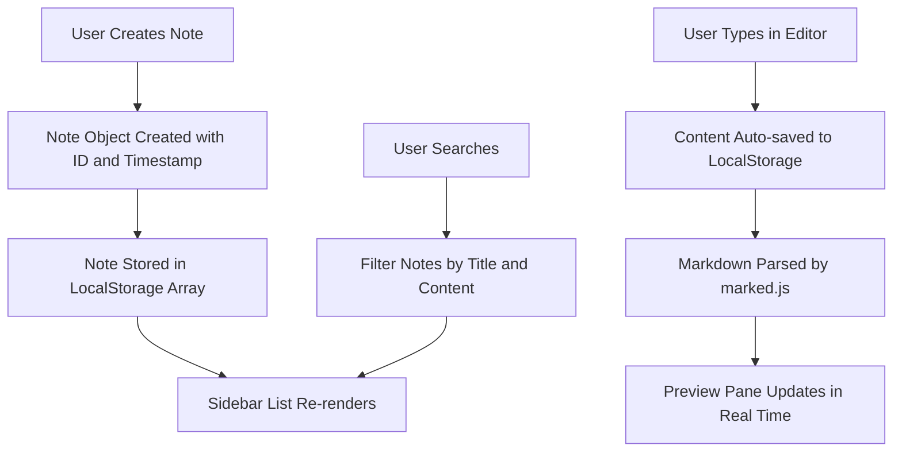

# Markdown Notes

A clean and minimal note taking app with live Markdown preview, built entirely with vanilla HTML, CSS, and JavaScript. No frameworks, no build tools, no dependencies. Just open the file in your browser and start writing.

Notes are saved automatically to your browser local storage, so they persist even after you close the tab.

## Features

- Write notes using Markdown syntax with instant live preview
- All notes saved to browser local storage automatically
- Search through your notes by title or content
- Dark theme designed for comfortable use during long writing sessions
- Tab key support inside the editor for indentation
- Character counter and save timestamp in the status bar
- Zero dependencies, works offline, no server required

## How It Works



## Getting Started

No installation needed. Just clone and open:

```bash
git clone https://github.com/Darkshaz/markdown-note-app.git
cd markdown-note-app
```

Then open `index.html` in any modern browser. That is it.

If you want a local development server:

```bash
npx serve .
```

## Usage

1. Click the **+** button in the sidebar to create a new note
2. Give your note a title in the input field at the top
3. Start writing Markdown in the editor area
4. Click **Preview** to see your formatted note
5. Click **Edit** to go back to writing mode
6. Use the search bar to find specific notes quickly
7. Click **Delete** to remove a note you no longer need

## Supported Markdown

The app supports standard Markdown syntax including:

- Headings (h1 through h6)
- Bold, italic, and strikethrough text
- Ordered and unordered lists
- Code blocks with syntax highlighting
- Blockquotes
- Tables
- Links and images

## Tech Stack

- **HTML5** for document structure
- **CSS3** with CSS Grid and Flexbox for layout
- **Vanilla JavaScript** (ES6 classes) for app logic
- **marked.js** for Markdown parsing
- **localStorage** for data persistence

## File Structure

```
markdown-note-app/
    index.html      Main HTML file
    style.css       All styling
    app.js          Application logic
    marked.min.js   Markdown parser library
    README.md       This file
```

## License

MIT License
